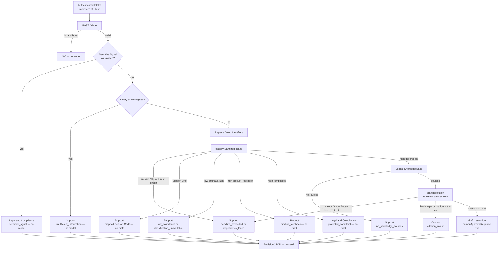

# Bankrate triage prototype

Fail-closed `POST /triage` for authenticated Member Intakes. AI drafts eligible General Q&A or routes Product Feedback and Compliance. Everything else goes to Support. A human must approve every Member-Facing Response. **This prototype does not send one.**

Synthetic data only. Not Bankrate production policy, not measured 80% performance.

### Important Documents
- [`RFC`](docs/rfc.md)
- [`Terms`](CONTEXT.md)
- [`AI Leverage Log`](docs/ai-leverage-log.md)
- [`Bring Business Team Along`](docs/bring-business-team-along.md)

## Flow



Layer 1 halt (Sensitive Signal, empty text) skips the model. Identifier scrub continues. Every path still requires human approval before any Member-Facing Response; this prototype never sends one.

## Stated assumptions

From the RFC. They narrow the prototype; they are not claims about Bankrate today.

- Upstream already authenticated the Member. Triage gets an opaque `memberRef` and ignored `claims`. It does not authenticate.
- Three categories are enough to show the policy seam: General Q&A, Product Feedback, Compliance.
- Routing to Product or Legal & Compliance counts as AI-handled. Support is the leftover.
- Approval exists conceptually. This repo does not implement review or send.
- Ticketing and member-profile are boundaries only. No Profile Facts, Cases, or Approval Tasks.
- Local help-center fixtures stand in for a knowledge base. Not a RAG design.
- Identifier scrub is pattern replacement on synthetic email / phone / account-like values. PAN and SSN-like values are Sensitive Signals. Names are not removed.
- 80% is a later Shadow Run / production measurement. CI does not assert a mix.

## Limits worth knowing

- Support vetoes (advice, personal-record, mixed intent, …) are `classify` outcomes. CI configures the fake. There is no production phrase matcher.
- Layer 1 (Sensitive Signal, empty text, Direct Identifier scrub) is the only path that may skip `classify`.
- Circuits stay open after a failure. No half-open recovery in this slice.
- Empty draft `citations: []` is still schema-valid.
- Residual PII (names, quasi-identifiers) can still reach the model after scrub.

## Run

```bash
npm install
npm test              # Vitest, fakes only
npm run typecheck
npm run demo:scenarios
```

`npm test` is the CI suite: pipeline, HTTP contract, twelve RFC demonstration rows, and Blocking Safety Gates. No live model.

## Scenario runner

`npm run demo:scenarios` posts all twelve RFC Demonstration Scenarios to the real `/triage` handler **in-process**.

- **Fake mode only.** Each row uses a `FakeModelGateway` configured for that Intake (high Q&A, Support veto, throw, …). There is no live-provider flag.
- Prints one line per scenario: name, `intakeId`, action, destination or draft citations, `reasonCodes`.
- Exits 0 when every row returns a schema-valid Decision.
- Fresh dependency circuits per row so one fail-closed case does not trip the rest.

Fixtures live in `src/demonstration-scenarios.ts` (shared with CI). Runner: `src/run-demonstration-scenarios.ts`.

## What you should see

| Kind | Typical outcome |
| --- | --- |
| Help-center how-to with a fixture source | `draft_resolution`, citations, `humanApprovalRequired: true` |
| How-to with no source | Support, `no_knowledge_sources` |
| Product suggestion | Product, `product_feedback` |
| Regulator / legal / PAN / SSN-like | Legal & Compliance, `sensitive_signal`, no model |
| Advice, “what is my APR?”, mutation, mixed, empty, out of scope | Support, mapped Reason Code |
| Low confidence, timeout, throw, open circuit | Support, `low_confidence` / `deadline_exceeded` / `dependency_failed` |

Support fallback is not “AI-handled.” AI-handled means a policy-correct draft or a policy-correct route to Product or Legal & Compliance.

## HTTP

`POST /triage` accepts `intakeId`, `memberRef`, `claims`, `text`, and allowlisted metadata (`channel`, `locale`, `surface`). Unknown metadata is dropped. Invalid bodies are 400 and never call the model.

The handler returns Decision JSON only. No Case, no Approval Task, no send.

Audit logs (when a logger is injected) are a six-field allowlist: `intakeId`, `category`, `action`, `classificationConfidence`, `humanApprovalRequired`, `reasonCodes`. Not logged: raw Intake text, prompts, `memberRef`, `claims`, `route`, `draftResponse`.
